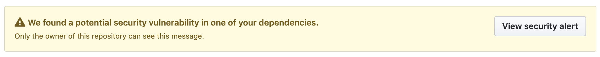
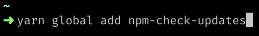
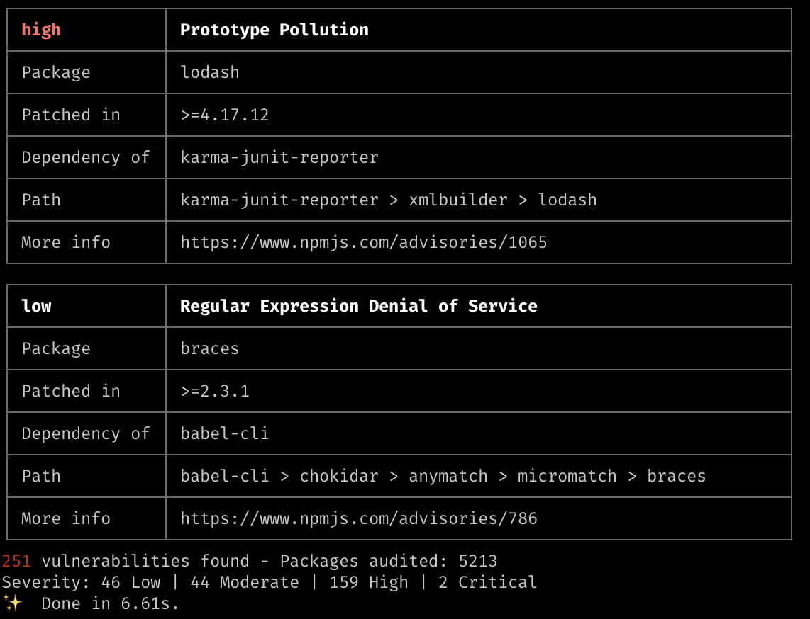
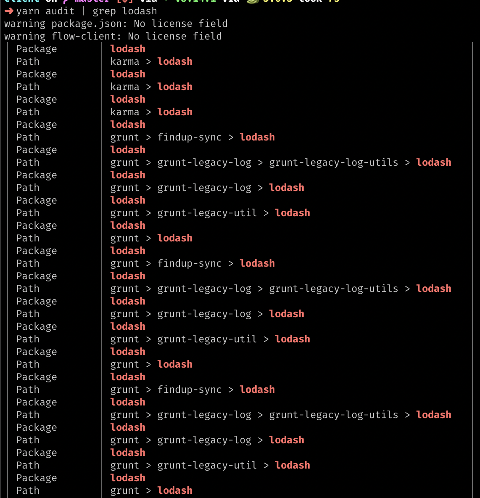
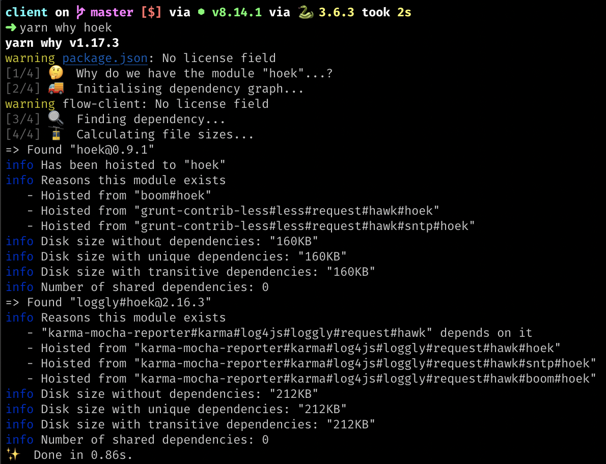
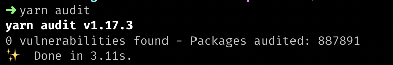

Upgrading packages, for the good sake of *keeping them upto-date* or for the reason one or few packages
has *security vulnerabilities*, quite often easier! But sometimes it gets tricky and bite us. However auditing and understanding how the packages are used by other packages give us clear picture.

**Tools you required**: `yarn` and `npm-check-updates`

<!--  -->

  To install `npm-check-updates`,
  run `yarn global add npm-check-updates`. it will create alias `ncu`

**Strategy for upgrading particular package/particular group of packages
(suitable for projects with lot of dependencies or for projects with less test coverage)**:
<figure>
    
    <figcaption align="center"><pre>Fig.1. yarn audit</pre></figcaption>
</figure>

<figure>
    
    <figcaption align="center"><pre>Fig.2. yarn audit | grep lodash</pre></figcaption>
</figure>

<figure>
    
    <figcaption align="center"><pre>Fig.3. yarn why hoek</pre></figcaption>
</figure>


1. Get info about the `<package>`(direct or transient/sub-depedency)
     - `yarn audit | grep <package>` - to check how many of the dependencies/sub-dependencies affected by the `<package>`)

     - `yarn why <package>` - to check which dependencies and transient dependencies uses the \<package\> and which hoisted versions of the `<package>` so that it is easy to evaluate [selective dependency resolution](https://yarnpkg.com/en/docs/selective-version-resolutions) is possible when that is the only option

2. `ncu -u <package>`, example `ncu -u ‘/^webpack*$/’` will bump the version of packages starts with webpack in package.json (will not automatically install the packages)
3. `yarn` (to install the updated package)
4. `yarn upgrade <package>` will fix updated package’s dependencies and transient dependencies in `yarn.lock` to latest w.r.t version range specified in `package.json` (refer other useful comments for how to upgrade package groups)

5. Fix breaking changes in the dependency you upgraded (most likely if you bump major version)
6. evaluate if selective dependency resolution is needed -> `yarn audit` still complains
7. WARNING: `yarn upgrade` also possible but commit the changes until step 5 before you try this beast (it may break most likely when the packages haven't been upgraded for long time)

You can repeat this steps package by package

**Greedy strategy(suitable for projects with less dependencies and for projects with 100% coverage)**:
```sh
1. ncu -u
2. yarn
3. yarn upgrade
4. evaluate if selective dependency resolution is needed -> `yarn audit` still complains
5. Fix breaking changes (builder: webpack, test: jest, lint: eslint, etc.,)
```


** - `yarn upgrade` or `yarn upgrade <package>` is the key that it re-creates `yarn.lock` with latest deps and transient deps w.r.t version range specified in `package.json`

<figure>
    
    <figcaption align="center"><pre>Fig.4. yarn audit 😊</pre></figcaption>
</figure>

**Other useful comments**:

`yarn upgrade —pattern <glob>`, will upgrade all the packages that matches the `<glob>`
`yarn upgrade —scope <scope>`,  will upgrade all the scoped packages `@scope`
