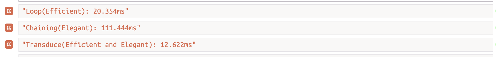

### Prerequisite
Need some basic understanding of
- [Functional programming](https://en.wikipedia.org/wiki/Functional_programming)
- [Transducer](https://jrsinclair.com/articles/2019/magical-mystical-js-transducers/)

I will also link more interesting articles about functional programming and transducers.

### Excercise

Now run the following code-which is in nutshell, just filter registered users and sum up the total discount from the given millions of users(array) in 3 different ways 1) -against nodejs versions 8, 9, 10, 12

<pre style="border: 1px solid; padding: 20px">
const { map, filter, compose, transduce } = require('ramda');

// utils
const timeIt = (label, fn) => {
  console.time(label);
  fn();
  console.timeEnd(label);
};

const getRange = n => [...Array(n).keys()]

// data
const users = getRange(1000000).map((_, index) => ({
  registered: index % 2 === 0,
  discount: 1,
}))

// helpers
const isRegistered = user => user.registered;
const getDiscount = user => user.discount;
const totalDiscountReducer = (
  totalDiscount,
  discount
) => totalDiscount + discount;

// efficient way to get total discount
const getTotalDiscountForRegisteredUsersEfficiently = () => {
  let totalDiscount = 0;
  users.forEach(user => {
    if(user.registered) totalDiscount += user.discount;
  })
  return totalDiscount;
}

// elegant way to get total discount
const getTotalDiscountForRegisteredUsersElegantly = () => users
  .filter(isRegistered)
  .map(getDiscount)
  .reduce(totalDiscountReducer, 0)

const getDiscountForRegisteredUser = compose(
  filter(isRegistered),
  map(getDiscount)
);
// elegant and efficient way to get total discount
const getTotalDiscountForRegisteredUsers = () => transduce(
  getDiscountForRegisteredUser,
  totalDiscountReducer,
  0,
  users
)

timeIt(
  'Loop(Efficient)',
  getTotalDiscountForRegisteredUsersEfficiently
)
timeIt(
  'Chaining(Elegant)',
  getTotalDiscountForRegisteredUsersElegantly
)
timeIt(
  'Transduce(Efficient and Elegant)',
  getTotalDiscountForRegisteredUsers
)
</pre>

I have prepared runkit link too: https://runkit.com/peramanathan/transducer-simplified

### Match your results

- Node 8:
<pre style="border: 1px solid">
"Loop(Efficient): 25.328ms"
"Chaining(Elegant): 247.965ms"
"Transduce(Efficient and Elegant): 631.458ms"
</pre>
- Node 9:
<pre style="border: 1px solid">
"Loop(Efficient): 21.147ms"
"Chaining(Elegant): 154.018ms"
"Transduce(Efficient and Elegant): 688.818ms"
</pre>
- Node 10:
<pre style="border: 1px solid">
"Loop(Efficient): 17.144ms"
"Chaining(Elegant): 106.336ms"
"Transduce(Efficient and Elegant): 14.785ms"
</pre>
- Node 11
<pre style="border: 1px solid">
"Loop(Efficient): 21.290ms"
"Chaining(Elegant): 152.711ms"
"Transduce(Efficient and Elegant): 16.327ms"
</pre>
- Node 12
<pre style="border: 1px solid">
"Loop(Efficient): 34.232ms"
"Chaining(Elegant): 102.873ms"
"Transduce(Efficient and Elegant): 11.597ms"
</pre>

### Read more

- [Transducers: Supercharge your functional JavaScript](https://www.jeremydaly.com/transducers-supercharge-functional-javascript/)
- [Ramda-transduce](https://gist.github.com/craigdallimore/8b5b9d9e445bfa1e383c569e458c3e26)
- [Efficient data transformation](https://www.freecodecamp.org/news/efficient-data-transformations-using-transducers-c779043ba655/)
- [Most adequate guide to functional programming](https://github.com/MostlyAdequate/mostly-adequate-guide)
